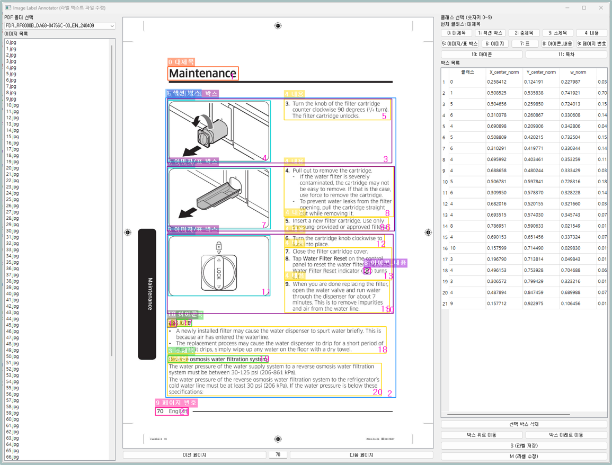
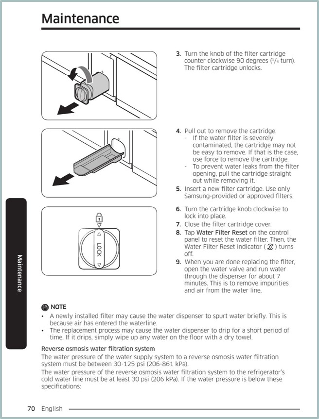
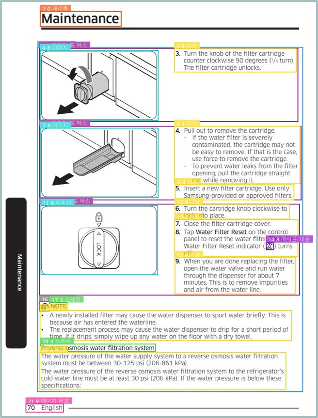
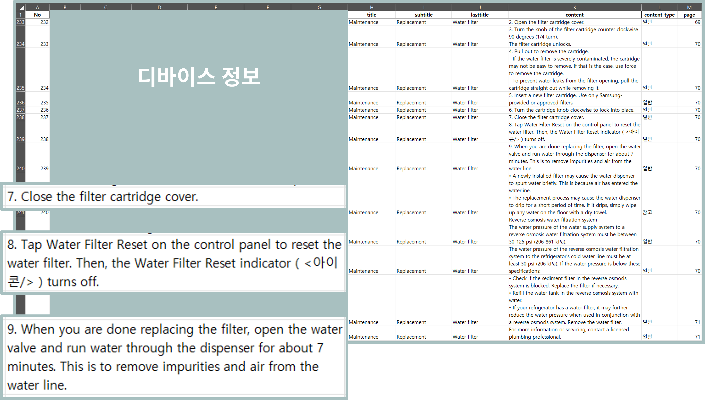

# Bixby DQA Automation (Document → QA Auto Pipeline)

> 삼성전자 제품 설명서 PDF로부터 Bixby DQA용 QA 데이터를 자동 생성하는 엔드투엔드 파이프라인
> 기간: 2024.12 – 2025.04 | 역할: Vision·Document AI 설계·구현 전담

---

## Summary

* 삼성전자 제품 설명서 PDF에서 **레이아웃 검출 → 읽기 순서 정렬 → QA 자동 생성 → DQA DB 구조화**까지 완전 자동화 파이프라인 구축
* 모델·툴·규칙·출력 스키마를 통합하여 **실제 납품 가능한 형태의 결과물 생산**

---

## Model & Algorithms

* **Detection**: YOLOv12x 기반 문서 레이아웃 검출 (12 classes)
* **Ordering**: 좌표 정규화 + 영역 히스토그램 기반 컬럼 추정 + 규칙 기반 Reading Order 알고리즘
* **QA Generation**: 제목–본문–표/이미지 관계 기반 Rule-based QA 생성 + 스키마 검증
* **Export**: 생성 결과를 Bixby DQA 스키마로 자동 변환(JSON/Excel)

## My Contribution

* PDF 레이아웃 데이터 생성 및 검수를 위한 **라벨링 툴 자체 개발**
* **YOLOv12x 기반 PDF 레이아웃 검출 모델 학습** (12 classes 정의 및 학습데이터 구축)
* 사람이 읽는 순서를 반영한 **블록 정렬 알고리즘 설계(Reading Order)**
* 텍스트/제목/표/이미지 관계 기반 **QA 자동 생성 알고리즘 설계 및 검수 체계화**
* 산출물 변환 스크립트로 **Bixby DQA DB 스키마로 직접 적재 가능한 출력 완성**

---

## Performance (Layout Detection by Class)

| 클래스      | 이미지 수 | 객체 수 | Precision | Recall | mAP@0.5 | mAP@0.5:0.95 |
| -------- | ----: | ---: | --------: | -----: | ------: | -----------: |
| **전체**   |   440 | 7347 |     0.967 |  0.954 |   0.973 |        0.939 |
| 제목       |   263 |  273 |     0.993 |  1.000 |   0.995 |        0.989 |
| 섹션 박스    |   426 |  613 |     0.982 |  0.974 |   0.990 |        0.978 |
| 소제목      |   218 |  288 |     0.958 |  0.941 |   0.980 |        0.959 |
| 세부제목     |   308 |  797 |     0.950 |  0.956 |   0.965 |        0.928 |
| 내용       |   375 | 2948 |     0.907 |  0.901 |   0.938 |        0.888 |
| 이미지/표 박스 |   305 |  644 |     0.977 |  0.975 |   0.990 |        0.969 |
| 이미지      |   190 |  480 |     0.984 |  0.985 |   0.986 |        0.981 |
| 표        |   153 |  229 |     0.993 |  0.978 |   0.994 |        0.993 |
| 아이콘_내용   |    49 |  190 |     0.896 |  0.774 |   0.863 |        0.725 |
| 페이지 번호   |   421 |  421 |     0.997 |  1.000 |   0.995 |        0.924 |
| 아이콘      |   229 |  450 |     0.986 |  0.969 |   0.984 |        0.934 |
| 목차       |    11 |   14 |     0.977 |  1.000 |   0.995 |        0.995 |

---

## Visual Examples

### 1) Labeling Tool

  

### 2) 원본 vs 레이아웃 결과

  
  

### 3) Structured Export (Excel)

  

---
